<div align="center">

# 🇪🇹 Addis Eats 
### Modern Ethiopian Culinary Ordering & Restaurant Operations Platform

An authentic, end-to-end food ordering and kitchen operations platform built with **React 19**, **Vite**, and **Zustand**. Designed specifically for the culinary culture of Addis Ababa, featuring dual-channel fulfillment (**City-wide Courier Delivery** and **Contactless Dine-in QR Ordering**), real-time cart state, and a full-featured **Administrative Operations Back-Office**.

<br />

[](https://react.dev/)
[](https://vite.dev/)
[](https://reactrouter.com/)
[](https://zustand-demo.pmnd.rs/)
[](https://oxc.rs/)
[](#)

<br />

<p align="center">
  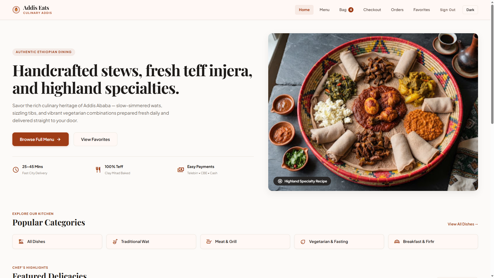
</p>

[Explore Menu](#-visual-feature-showcase) • [Dine-In QR Flow](#-contactless-table-qr-ordering) • [Admin Operations](#-administrative-operations-suite) • [Tech Stack](#-technology-stack) • [Quickstart](#-getting-started)

</div>

---

## 📑 Table of Contents
- [Executive Overview](#-executive-overview)
- [Key Features](#-key-features)
- [Visual Feature Showcase](#-visual-feature-showcase)
  - [1. Storefront & Menu Catalog](#1-storefront--menu-catalog)
  - [2. Dish Detail & Customization](#2-dish-detail--customization)
  - [3. Order Bag & Subtotal Engine](#3-order-bag--subtotal-engine)
  - [4. Ethiopian Checkout & Settlement Gateways](#4-ethiopian-checkout--settlement-gateways)
  - [5. Contactless Table QR Ordering](#5-contactless-table-qr-ordering)
  - [6. Administrative Operations Suite](#6-administrative-operations-suite)
  - [7. Day & Night Experience](#7-day--night-experience)
- [Technology Stack](#-technology-stack)
- [Delivery vs. Dine-In Ordering Matrix](#-delivery-vs-dine-in-ordering-matrix)
- [Application Routes](#-application-routes)
- [State Management & Data Persistence](#-state-management--data-persistence)
- [Project Architecture](#-project-architecture)
- [Getting Started](#-getting-started)
- [Demo Credentials](#-demo-credentials)
- [Quality Assurance & Standards](#-quality-assurance--standards)

---

## 🌟 Executive Overview

**Addis Eats** combines the rich culinary tradition of Ethiopia with modern web architecture. From slow-simmered wats and clay-mitad baked 100% pure teff injera to sizzling tibs and highland fasting platters, the application serves two core user groups:

1. **Diners & Customers**: Discover authentic dishes, filter by dietary requirements (e.g. Vegetarian/Fasting, Meat & Grill, Traditional Wat), customize line items with recipe ingredients, order for courier home dispatch or scan an on-table QR code for instant dine-in service, and pay via Ethiopian mobile payment gateways (**Telebirr**, **CBE Birr**, or **Cash**).
2. **Restaurant Operations & Kitchen Staff**: A protected, full-fledged operational management portal tracking live kitchen tickets, dynamically altering menu pricing and stock availability, and provisioning custom QR stations for dining tables across the venue.

---

## 🚀 Key Features

### 🍲 Customer Storefront
* **Dynamic Menu Catalog**: Loaded from high-fidelity dish datasets, complete with Amharic culinary names, high-resolution photography, price markers in Ethiopian Birr (`ETB`), and live stock badges.
* **Instant Debounced Search & Categorization**: Fast client-side searching across dish titles, descriptions, and spice profiles, synchronized with URL query parameters (`?category=...`).
* **Deep Dish Exploration**: Detailed view (`/menu/:id`) showcasing authentic spice palettes (Berbere, Niter Kibbeh, Awaze, Koseret), portion descriptions, and interactive quantity steppers.
* **Reactive Shopping Bag**: Persistent order bag with real-time subtotal computation, quantity modification, and automatic badge counts.
* **Localized Ethiopian Checkout**: District-aware delivery fee calculation (Bole, Kazanchis, Piassa, Summit, CMC, etc.), automatic first-order discounts, and integrated payment selection for **Telebirr SuperApp**, **CBE Birr Mobile**, and **Cash on Delivery**.
* **Order Tracking & Manifest Reorder**: Customer history manifest reading live order statuses (`Pending` &rarr; `Confirmed` &rarr; `Preparing` &rarr; `Out for Delivery` &rarr; `Delivered`), with one-click reordering back into the bag.
* **Favorites Collection**: Quick heart toggle on any dish, saved in a dedicated favorites gallery (`/favorites`).
* **Persistent Dual Theming**: Bespoke warm light aesthetic and deep charcoal dark mode driven by CSS variables.

### 🏢 Restaurant Operations & Kitchen Management
* **Role-Guarded Admin Console**: Protected route system (`/admin`) requiring administrative credential verification.
* **Operations KPI Dashboard**: Real-time business intelligence calculating total gross revenue, order volume, catalog count, and stock readiness.
* **Menu Catalog CMS**: Add new dishes, edit pricing, update descriptions, and toggle instant stock status (`Available` vs `Sold Out`) without server downtime.
* **Live Kitchen Queue**: Real-time order monitoring with 6-stage lifecycle progression, destination indicators, and ticket inspection.
* **Table & QR Code Station Engine**: Generate unique table stations (e.g. Window Booth, Main Hall, Garden Patio), automatically synthesize live QR codes, copy quick URLs (`/menu?table=X`), and download printable PNG QR codes for tabletop display.

---

## 📸 Visual Feature Showcase

> Below are selected high-fidelity previews highlighting key features of Addis Eats.

### 1. Storefront & Menu Catalog
*Discover authentic Ethiopian highland specialties with instant category filters, real-time search, and availability states.*

<p align="center">
  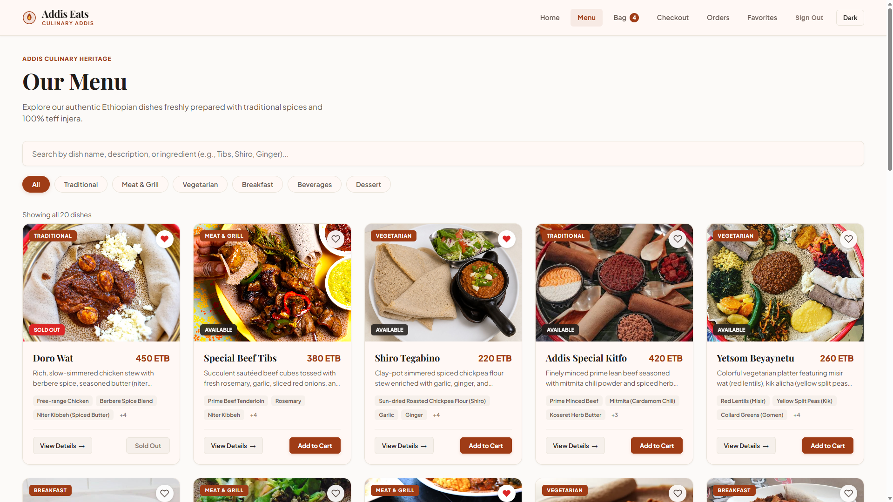
</p>

---

### 2. Dish Detail & Customization
*Inspect authentic ingredients, herbs (Niter Kibbeh, Awaze, Koseret), spice profiles, and customize portion quantities with real-time price calculations.*

<p align="center">
  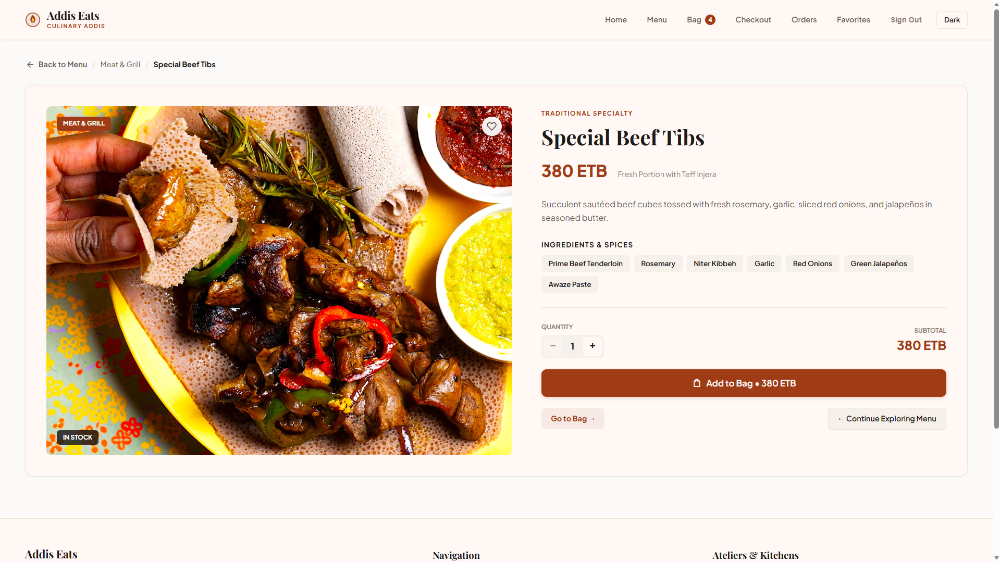
</p>

---

### 3. Order Bag & Subtotal Engine
*Manage order line items with live increment/decrement steppers, item removal, and accurate ETB subtotal tallying.*

<p align="center">
  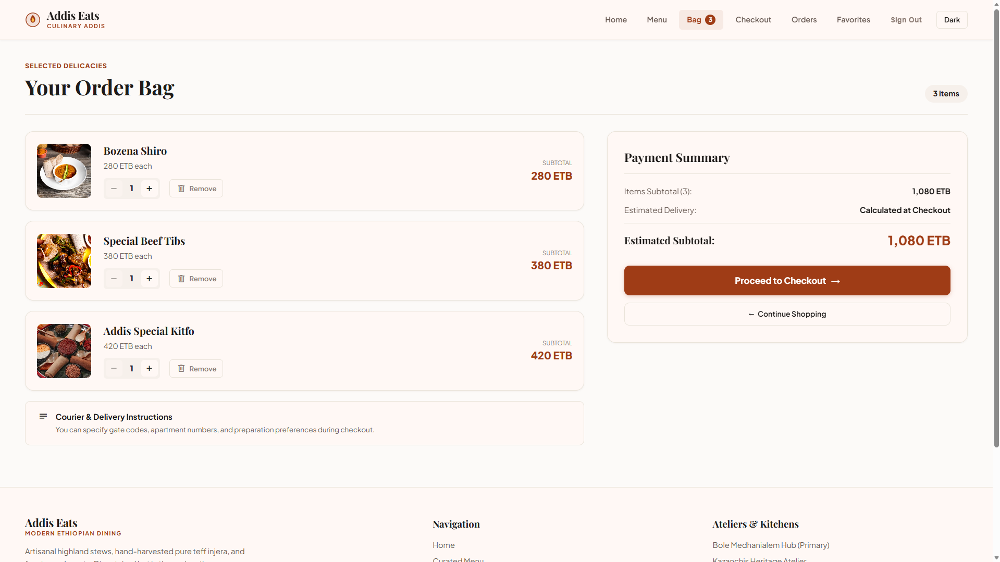
</p>

---

### 4. Ethiopian Checkout & Settlement Gateways
*Built for Addis Ababa: customer contact validation, district delivery dispatch calculation, and local payment integration with Telebirr SuperApp, CBE Birr Mobile, and Cash on Delivery.*

<p align="center">
  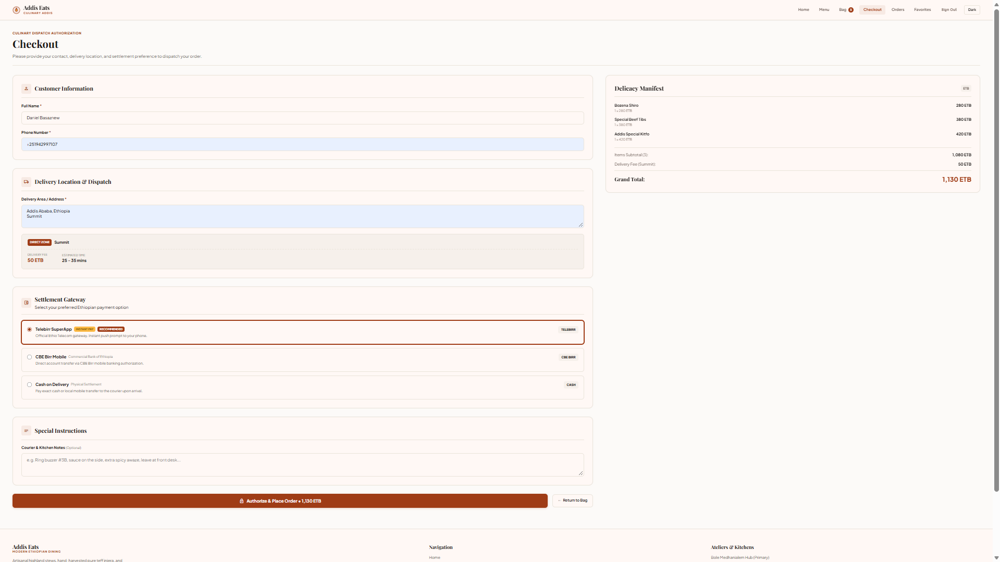
</p>

---

### 5. Contactless Table QR Ordering
*Restaurant dining stations powered by client-side dynamic QR generation (`qrcode`). Customers scan the tabletop QR code to place orders with automatic table attribution and 0 ETB delivery fee.*

<p align="center">
  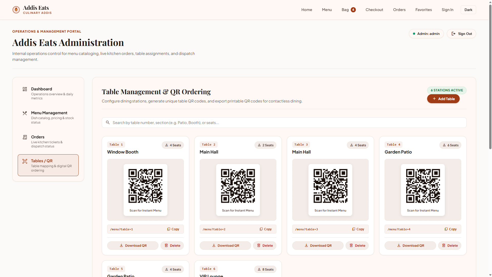
</p>

---

### 6. Administrative Operations Suite
*Complete internal back-office for restaurant managers and kitchen chefs.*

#### Operations KPI Dashboard
*Instant overview of gross revenue, completed tickets, active catalog items, and restaurant readiness.*
<p align="center">
  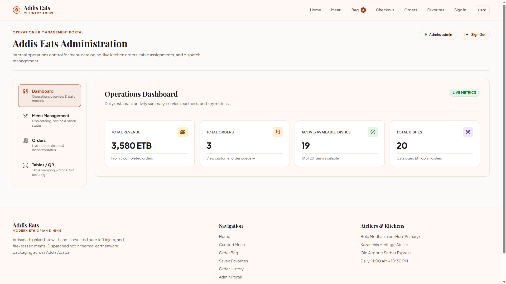
</p>

<br />

#### Menu Catalog CMS & Live Kitchen Order Fulfillment
*Real-time dish availability controls alongside a live 6-stage order dispatch pipeline.*

<p align="center">
  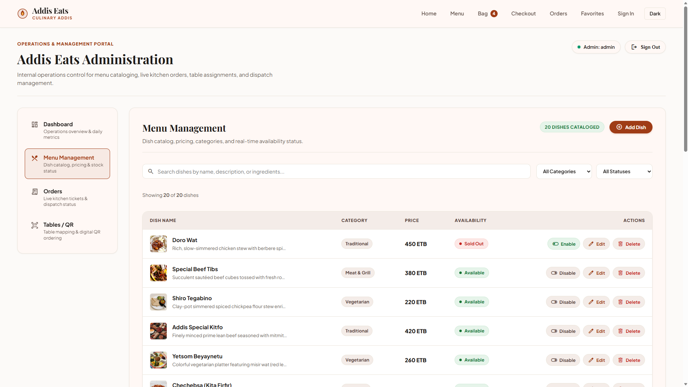
  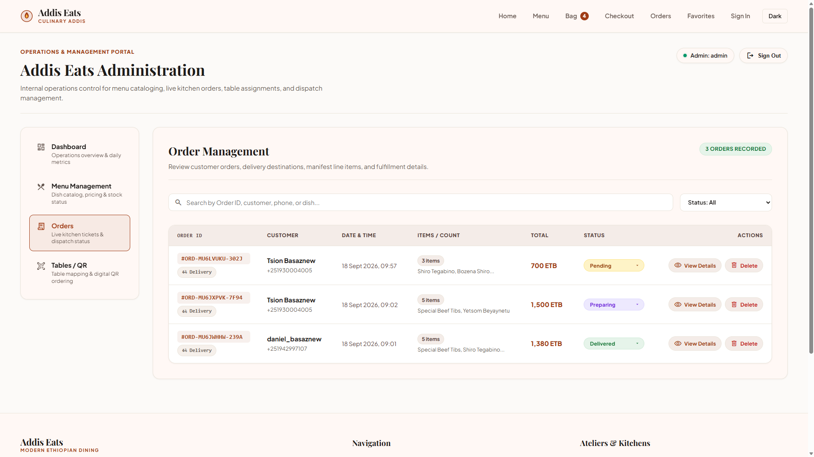
</p>

---

### 7. Day & Night Experience
*Seamless transition between high-contrast Dark Mode and warm, heritage-inspired Light Mode.*

<p align="center">
  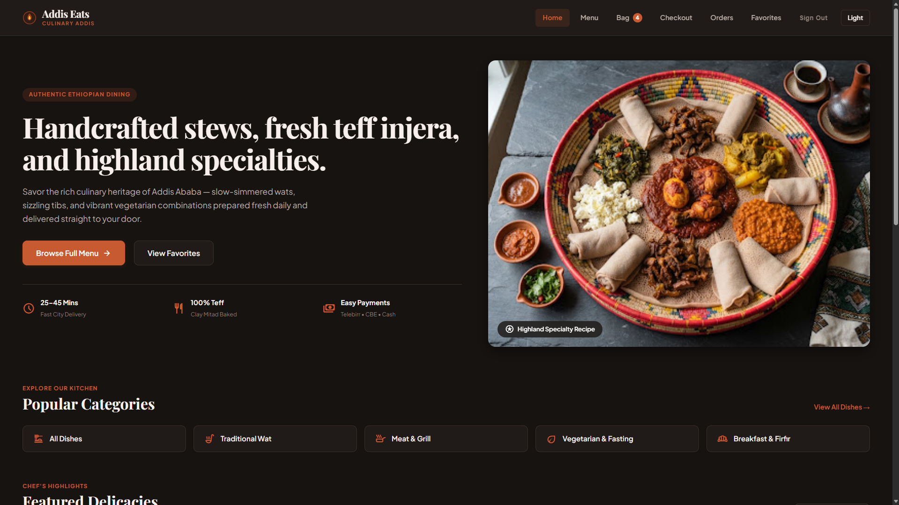
</p>

---

## 🛠️ Technology Stack

| Layer | Technology | Purpose / Notes |
| :--- | :--- | :--- |
| **Frontend Framework** | [React 19](https://react.dev/) | Modern functional components, hooks, concurrent rendering |
| **Routing** | [React Router 7](https://reactrouter.com/) | Declarative client routing, query params, nested route guards |
| **State Management** | [Zustand 5](https://zustand-demo.pmnd.rs/) | Lightweight reactive stores with `persist` middleware |
| **QR Code Engine** | [node-qrcode](https://github.com/soldair/node-qrcode) | Dynamic in-browser canvas and PNG QR generation |
| **Styling & Theming** | Vanilla CSS3 | Custom properties (CSS variables), responsive flex/grid layouts |
| **Build System** | [Vite 8](https://vite.dev/) | Ultra-fast HMR and optimized production bundling |
| **Code Quality** | [Oxlint](https://oxc.rs/) | High-performance linter ensuring clean syntax and zero errors |

---

## 🔄 Delivery vs. Dine-In Ordering Matrix

Addis Eats provides specialized workflows for both city deliveries and on-premise diners:

| Dimension | Courier Delivery Order 🛵 | Dine-In Table Order 🍽️ |
| :--- | :--- | :--- |
| **Entry Point** | Standard `/menu` catalog | Scanned Table QR Code (`/menu?table={id}`) |
| **Destination** | Addis Ababa District / Customer Address | Assigned Station (e.g. *Window Booth #1*) |
| **Address Form** | Required & validated | Automatically bypassed |
| **Delivery Fee** | Calculated by area (50–90 ETB) | **0 ETB (Free)** |
| **ETA Timeline** | Courier transit estimate (25–55 mins) | Kitchen preparation time (15–25 mins) |
| **Settlement** | Telebirr, CBE Birr, Cash on Delivery | Telebirr, CBE Birr, Cash at Table |
| **Admin View** | Tagged with `Delivery` badge & customer address | Tagged with `Table #X` badge & station notes |

---

## 🗺️ Application Routes

| Route | Access | Description |
| :--- | :--- | :--- |
| `/` | Public | Storefront landing with chef's highlights, categories, and cultural overview |
| `/menu` | Public | Full dish catalog with live search, dietary filters, and table banner |
| `/menu/:id` | Public | Comprehensive dish detail view with ingredients list and quantity controls |
| `/cart` | Public | Order bag summary with quantity steppers and subtotal breakdown |
| `/checkout` | Customer Guarded | Form validation, delivery calculation, and Ethiopian payment settlement |
| `/orders` | Public | Customer past order manifests with live status and one-click reordering |
| `/favorites` | Public | Curated collection of user-favorited dishes |
| `/login` | Public | Customer authentication screen with 1-click demo access |
| `/admin/login` | Public | Administrator operations portal sign-in |
| `/admin` | Admin Guarded | Operations overview and daily KPI metrics |
| `/admin/:tab` | Admin Guarded | Direct access to admin tabs (`dashboard`, `menu`, `orders`, `tables`) |

---

## 💾 State Management & Data Persistence

The application maintains a single source of truth across customer and admin workflows using **Zustand** stores with persistent storage:

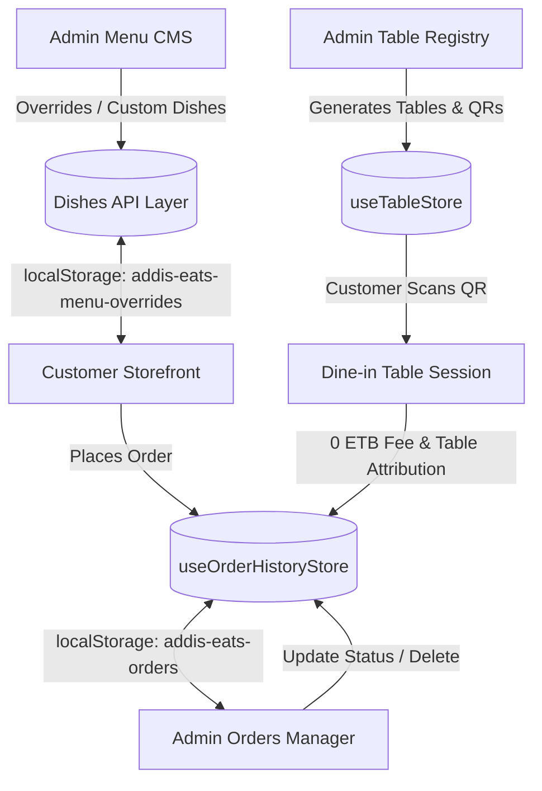

* **Cart Store (`useCartStore`)**: Persisted under `addis-eats-cart`. Automatically computes line items, item counts, and totals.
* **Order History Store (`useOrderHistoryStore`)**: Persisted under `addis-eats-orders`. Real-time bridge between customer order receipts and the admin kitchen queue.
* **Favorites Store (`useFavoritesStore`)**: Persisted under `addis-eats-favorites`.
* **Menu Overrides Store**: Persisted under `addis-eats-menu-overrides`, `addis-eats-custom-dishes`, and `addis-eats-deleted-dishes`. Ensures administrative edits survive page reloads.
* **Table Store (`useTableStore`)**: Persisted under `addis-eats-tables`.
* **Theme Store**: Persisted under `addis-eats-theme`.

---

## 📁 Project Architecture

```
addis-eats-react/
├── public/
│   ├── favicon.svg               # Application icon
│   └── menu-data.json            # Base authentic Ethiopian dish catalog
├── src/
│   ├── admin/                    # Operations & back-office suite
│   │   ├── Admin.jsx             # Admin shell & tab switcher
│   │   ├── AdminOrders.jsx       # Live kitchen queue & lifecycle actions
│   │   ├── AdminTables.jsx       # Table mapping & QR code generator
│   │   ├── DishFormModal.jsx     # Add/Edit dish catalog modal
│   │   ├── DeleteDishModal.jsx   # Deletion confirmation
│   │   ├── useAdminAuth.jsx      # Admin auth context & session guards
│   │   └── RequireAdmin.jsx      # Admin route guard
│   ├── api/                      # Data layer for dishes, overrides & mutations
│   ├── assets/                   # Static branding, logos & dish photography
│   ├── Asset/                    # High-fidelity project screenshots & walkthroughs
│   ├── auth/                     # Customer authentication & login screens
│   ├── cart/                     # Cart drawer, bag items & navigation badges
│   ├── checkout/                 # Checkout validation, district fees & payment gateways
│   ├── favorites/                # Customer saved favorites collection
│   ├── menu/                     # Menu catalog, dish cards, search & filters
│   ├── orders/                   # Order history manifests & one-click reorder
│   ├── skeleton/                 # Loading skeleton states
│   ├── theme/                    # Theme provider and light/dark toggles
│   ├── utils/                    # Formatting, currency (ETB), delivery & pricing math
│   ├── App.css                   # Global design tokens, typography & components
│   ├── App.jsx                   # Router hierarchy and route protection
│   └── main.jsx                  # Application entry point
├── package.json
└── vite.config.js
```

---

## ⚡ Getting Started

### Prerequisites
* **Node.js**: v18.0 or higher
* **npm**: v9.0 or higher

### 1. Clone the Repository
```bash
git clone https://github.com/your-username/addis-eats-react.git
cd addis-eats-react
```

### 2. Install Dependencies
```bash
npm install
```

### 3. Run Development Server
```bash
npm run dev
```
Open your browser at `http://localhost:5173` to start exploring.

### 4. Build for Production
```bash
npm run build
```
Generates an optimized static production bundle in `/dist`.

### 5. Preview Production Build
```bash
npm run preview
```

---

## 🔑 Demo Credentials

### Customer Login
* Navigate to `/login` or click **Sign In** in the navigation bar.
* Use the **One-Click Demo Customer Sign In** button, or enter any demo email and password.

### Administrator Login
* Navigate to `/admin/login` or click **Admin Portal** in the footer.
* **Username**: `admin`
* **Password**: `admin123` *(or click "Quick Admin Sign In (Demo Mode)")*

---

## 🛡️ Quality Assurance & Standards

Run the high-speed code linter:
```bash
npm run lint
```
The codebase strictly adheres to modern React standards, comprehensive error boundaries, accessible semantic elements, and zero lint warnings.

---

<div align="center">

Crafted with ❤️ for the vibrant flavors of **Addis Ababa** • Built with **React 19 & Vite**

</div>
